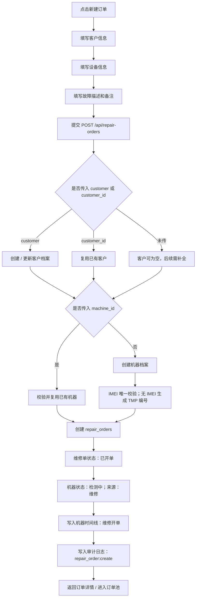

# 开单动作设计文档

本文档描述当前系统内“维修开单 / 新建订单”动作的界面、角色、数据、状态流转和系统副作用。本文以当前 `mis_mvp` 的机器生命周期主线为准：开单不是只创建一张维修单，而是把客户、机器、维修单、时间线和审计日志串成后续维修闭环的起点。

## 动作名称：新建维修订单

### 动作定位

新建维修订单是客户设备到店后的第一个系统动作，用于快速记录客户、设备和送修问题，并生成一张可被后续检测、报价、维修、交付、收款推进的维修单。

开单完成后，订单进入“已开单”状态，机器进入“检测中”状态；生产设计中，该订单应进入公共维修订单池，等待前台、管理员或老板指派工程师。

### 涉及员工角色

| 角色 | 权限定位 | 主要动作 |
| --- | --- | --- |
| 前台 | 主操作人 | 接待客户、录入客户信息、录入设备信息、描述客户故障、提交开单 |
| 管理员 | 可操作和兜底 | 可新建订单、查看全部订单、处理异常数据 |
| 老板 | 可查看和兜底 | 可查看全局订单和异常情况，必要时参与指派和纠错 |
| 工程师 | 后续处理人 可以开单| 开单账号如果是工程师则订单直接指派到工程师名下；订单被指派后负责检测、方案、报价和维修 |
| 财务 | 后续读取人 | 不参与开单；后续在收款、结账、报表中读取订单数据 |

当前权限接口要求用户拥有 `repair_order:create`；同时如果开单时需要创建新机器档案，还需要 `machine:create`。

### 界面操作元素

| 界面元素 | 位置 | 说明 |
| --- | --- | --- |
| 新建订单按钮 | 维修订单池筛选区右侧，或维修开单入口 | 打开新建维修订单页面 / 弹窗 |
| 新建订单页面 | 单独页面或弹窗均可 | 展示空白订单详情表单，用于录入客户、设备和故障信息 |
| 客户信息区 | 新建订单页面内 | 新建客户或选择已有客户 |
| 设备信息区 | 新建订单页面内 | 新建设备档案 |
| 故障描述区 | 新建订单页面内 | 记录客户口述故障、到店问题、前台备注 |
| 保存 / 提交开单按钮 | 新建订单页面底部 | 调用开单接口，生成维修单 |
| 取消按钮 | 新建订单页面底部 | 关闭页面，不写入数据 |

建议界面交互：

1. 用户点击“新建订单”。
2. 系统打开空白订单详情页。
3. 开单人员录入或选择客户。
4. 开单人员录入或选择设备。
5. 开单人员填写客户故障描述和接待备注。
6. 点击“保存 / 提交开单”。
7. 系统生成维修单，按照规则生成维修单号，并跳转到订单详情或维修订单池。

### 涉及数据

#### 客户信息

| 字段 | 说明 | 当前规则 |
| --- | --- | --- |
| `customer_id` | 已有客户 ID | 可选；传入后复用客户 |
| `customer.name` | 客户姓名 | 新建客户时必填 |
| `customer.phone` | 手机号 | 可选 |
| `customer.wechat` | 微信 | 可选 |
| `customer.type` | 客户类型 | 可选，例如散客、同行、企业客户 |
| `customer.remark` | 客户备注 | 可选 |

规则：如果传入 `customer`，系统会创建或更新客户档案；如果只传 `customer_id`，系统复用已有客户；如果都不传，则维修单可以先开出，但后续结账能力会受影响，生产使用建议至少保留客户姓名或手机号。

#### 设备信息

| 字段 | 说明 | 当前规则 |
| --- | --- | --- |
| `machine_id` | 已有机器 ID | 可选；传入后复用机器档案 |
| `machine.imei` | IMEI | 可选；非空时必须唯一 |
| `machine.serial` | 序列号 | 可选 |
| `machine.model` | 机型 | 新建机器时必填 |
| `machine.storage` | 容量 | 可选 |
| `machine.memory` | 内存 | 可选 |
| `machine.color` | 颜色 | 可选 |
| `machine.condition` | 外观 / 成色情况 | 可选 |
| `machine.remark` | 机器备注 | 可选 |

规则：开单必须关联一台机器。可以选择已有 `machine_id`，也可以提交 `machine` 新建设备档案。新建设备时，如果 IMEI 为空，系统生成 `TMP-` 开头的临时机器编号；如果 IMEI 不为空，系统校验唯一性。

#### 订单信息

| 字段 | 说明 | 当前规则 |
| --- | --- | --- |
| `fault_description` | 客户口述故障 | 可为空，但生产建议必填 |
| `remark` | 前台接待备注 | 可选 |
| `created_by` | 开单人 | 系统按当前登录用户写入 |
| `status` | 维修单状态 | 系统默认写入 `已开单` |
| `workflow_status` | 待办归属 | 生产设计建议为 `待指派工程师` |

### 后端接口

```http
POST /api/repair-orders
```

请求结构：

```json
{
  "machine_id": null,
  "machine": {
    "imei": "",
    "serial": "",
    "model": "iPhone 15 Pro",
    "storage": "256G",
    "memory": "",
    "color": "蓝色",
    "condition": "外屏碎裂",
    "remark": "客户称未进水"
  },
  "customer_id": null,
  "customer": {
    "name": "张三",
    "phone": "13800000000",
    "wechat": "",
    "type": "散客",
    "remark": ""
  },
  "fault_description": "客户描述无法充电",
  "remark": "前台初检可开机"
}
```

成功返回：维修单详情，包括维修单、机器、客户、维修项目、付款、时间线事件和可用动作。

### 系统处理流程



### 状态变化

| 对象 | 开单前 | 开单后 |
| --- | --- | --- |
| 维修单 | 不存在 | `已开单` |
| 机器 | 不存在、到店或其他已有状态 | `检测中` |
| 机器业务来源 | 空或原来源 | `维修` |
| 待办归属 | 无 | 建议为公共订单池 / 待指派工程师 |
| 时间线 | 无本次维修事件 | 新增 `维修开单` |
| 审计日志 | 无 | 新增 `repair_order:create` |

### 数据写入范围

开单可能写入以下表或数据集合：

| 数据对象 | 写入场景 | 说明 |
| --- | --- | --- |
| `customers` | 新建或更新客户时 | 由 `customer` 信息触发 |
| `machines` | 新建设备时 | 创建机器档案，生成机器编号 |
| `repair_orders` | 每次成功开单 | 创建维修单主记录 |
| `machine_events` | 每次成功开单 | 写入 `维修开单` 时间线 |
| `audit_logs` | 每次成功开单 | 写入 `repair_order:create` 操作审计 |

### 校验规则

| 校验点 | 规则 |
| --- | --- |
| 权限 | 当前用户必须拥有 `repair_order:create` |
| 机器来源 | 必须提供 `machine_id` 或 `machine` |
| 已有机器 | `machine_id` 必须存在 |
| 新机器机型 | `machine.model` 必填 |
| IMEI 唯一性 | 新机器 IMEI 非空时不能与已有机器重复 |
| 客户姓名 | 新建客户时 `customer.name` 必填 |
| 状态写入 | 用户不能手工指定开单后的维修状态，系统固定为 `已开单` |

### 异常提示

| 场景 | 建议提示 |
| --- | --- |
| 未选择或录入设备 | `必须提供机器档案或 machine_id` |
| 选择的机器不存在 | `机器档案不存在` |
| 新建设备缺少机型 | `请填写机型` |
| IMEI 重复 | `IMEI 已存在，不能重复建档` |
| 新建客户缺少姓名 | `请填写客户姓名` |
| 用户无权限 | `当前账号无维修开单权限` |

### 开单后的下一步动作

| 下一步 | 操作人 | 说明 |
| --- | --- | --- |
| 指派工程师 | 前台 / 管理员 | 将公共订单池订单分配给工程师 |
| 开始检测 | 工程师 | 订单进入 `检测中` |
| 补充资料 | 前台 / 管理员 | 补充客户、设备、备注等非专业信息 |
| 作废订单 | 前台 / 管理员 / 有权限人员 | 客户取消、误开单或设备不进修时使用 |

### 设计建议

1. 新建订单入口应优先放在维修订单池顶部右侧，便于前台边查单边开单。
2. 新建订单页面建议使用“客户信息、设备信息、故障信息”三段式表单，减少前台接待时的认知负担。
3. 客户和设备都应支持“搜索已有 / 直接新建”两种模式，避免重复客户和重复机器。
4. 开单后建议直接显示订单详情，并突出下一步“指派工程师”。
5. 对于无 IMEI 或资料不全的到店设备，允许先用临时机器编号开单，但应在订单池中标记“资料待补”。
6. 前台只记录客户口述故障和接待备注；专业检测结论、维修方案、报价应由工程师在后续节点填写。
7. 开单动作必须写入机器时间线和审计日志，保证后续可追溯。

### 当前实现对应关系

| 设计项 | 当前实现 |
| --- | --- |
| 开单接口 | `POST /api/repair-orders` |
| 请求模型 | `RepairOrderInput` |
| 机器创建 / 复用 | `_ensure_machine()` |
| 客户创建 / 复用 | `_customer_id()` / `upsert_customer()` |
| 默认维修单状态 | `已开单` |
| 默认机器状态 | `检测中` |
| 时间线事件 | `维修开单` |
| 审计动作 | `repair_order:create` |

