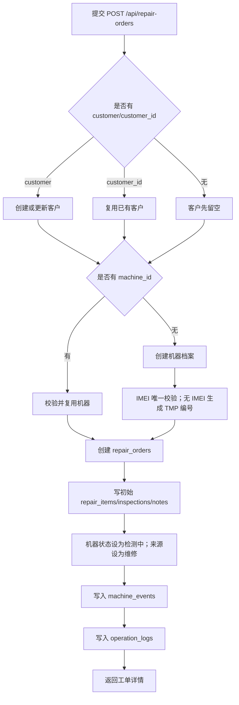

# 新建维修工单动作设计

本文档描述当前系统“新建维修工单”动作的真实实现和后续开发约束。开单不是只新增一行维修记录，而是把客户、机器、维修工单、时间线和审计串成维修闭环的起点。

## 1. 动作定位

动作名称：新建维修工单  
后端接口：`POST /api/repair-orders`  
前端入口：维修工单池的新建订单、历史“维修开单”入口  
服务方法：`MisService.create_repair_order()`

开单成功后：

- 生成维修工单。
- 创建或复用机器档案。
- 创建或复用客户档案。
- 维修单状态为 `已开单`。
- 机器状态进入 `检测中`。
- 写入机器时间线。
- 写入操作审计。

## 2. 角色和权限

需要权限：

- `repair_order:create`
- 若新建机器，还需要 `machine:create`

角色定位：

| 角色 | 开单关系 |
| --- | --- |
| 前台 | 主要开单人，负责快速接待、客户资料、机器资料和客户口述故障 |
| 工程师 | 可以开单；当前实现会把工程师自己创建的维修单直接指派给自己 |
| 管理员/老板/staff | 可开单和兜底处理异常 |
| 财务 | 不参与开单，后续读取订单和处理收款结账 |

## 3. 请求结构

`RepairOrderInput` 支持：

```json
{
  "machine_id": null,
  "machine": {
    "imei": "",
    "serial": "",
    "model": "iPhone 15 Pro",
    "memory": "256GB",
    "color": "蓝色",
    "condition": "外屏碎裂",
    "source_type": "维修",
    "customer_id": null,
    "customer": null,
    "remark": "客户称未进水"
  },
  "customer_id": null,
  "customer": {
    "name": "张三",
    "phone": "13800000000",
    "wechat": "",
    "category": "个人客户",
    "shop_name": "",
    "tags": "",
    "remark": ""
  },
  "fault_description": "客户描述无法充电",
  "remark": "前台初检可开机",
  "repair_items": [],
  "inspections": [],
  "notes": [],
  "note_logs": []
}
```

说明：

- 必须提供 `machine_id` 或 `machine`。
- `machine.model` 是新建机器时的必填字段。
- `customer_id` 和 `customer` 都可选，但生产使用建议至少保留客户姓名或电话。
- `repair_items`、`inspections`、`notes` 支持开单时顺带写入初始项目、检测项和备注。

## 4. 系统处理流程



## 5. 状态和副作用

| 对象 | 开单后结果 |
| --- | --- |
| `repair_orders.status` | `已开单` |
| `repair_orders.workflow_status` | 默认进入待处理/待指派语义 |
| `repair_orders.assigned_to` | 工程师开单时可自动指派到本人；其他角色通常待指派 |
| `machines.current_status` | `检测中` |
| `machines.source_type` | `维修` |
| `machine_events` | 新增维修开单事件 |
| `operation_logs` | 新增 `repair_order:create` |

## 6. 校验和错误

| 场景 | 结果 |
| --- | --- |
| 未传机器 | `必须提供机器档案或 machine_id` |
| `machine_id` 不存在 | `机器档案不存在` |
| 新机器缺少机型 | Pydantic 校验失败 |
| IMEI 重复 | `IMEI 已存在，不能重复创建机器档案` |
| 新客户缺少姓名 | Pydantic 校验失败 |
| 当前角色无权限 | HTTP 403 |

## 7. 前端交互建议

新建页面应保持三段式：

1. 客户信息：支持搜索已有客户和直接新建。
2. 机器信息：支持搜索已有机器和直接新建；IMEI 可空。
3. 故障和备注：客户口述故障、前台备注、可选检测项和初始维修项目。

提交后建议直接进入工单详情，突出下一步：

- 前台/管理员：指派工程师。
- 工程师：开始检测或补检测记录。
- 资料不全：补客户、IMEI、序列号、机型等关键字段。

## 8. 开发约束

- 开单动作必须走 `MisService.create_repair_order()` 或对应 API，不要绕过服务层直接写表。
- 不允许前端手工指定开单后的最终状态。
- 客户描述、工程师检测结论和维修方案保持分离。
- 无 IMEI 可先开单，但订单池应能识别资料待补。
- 开单失败不能写半截客户、机器或工单；服务层应保持事务一致。
- 后续如果扩展图片、验机清单、客户授权书，应作为开单附属记录，不塞进单个备注字符串。
